

# Dev_Setup
Setup Development Environment

#Assignment: Setting Up Your Developer Environment

#Objective:
This assignment aims to familiarize you with the tools and configurations necessary to set up an efficient developer environment for software engineering projects. Completing this assignment will give you the skills required to set up a robust and productive workspace conducive to coding, debugging, version control, and collaboration.

#Tasks:

1. Select Your Operating System (OS): Windows 11    
   Choose an operating system that best suits your preferences and project requirements. Download and Install Windows 11. https://www.microsoft.com/software-download/windows11 
 I installed windows 11 through update option and the steps are as follows:
 Step 1: Head over to Settings > Update & security. From there, click Check for updates
 Step 2: You should notice a prompt for Upgrade to Windows 11 is ready, and it's free. Click the blue Download and install button and agree to the terms with the Accept and install button.
 Step 3: You should then see the Upgrade to Windows 11 appear under Windows Update, with a percentage and download status. Wait for it to complete.

Step 4: When finished, you'll get a prompt to restart your PC. It'll show up in a blue box. Choose the Restart now option. Your PC will proceed with Windows 11 installation and will restart a few times. When finished, you'll be taken to the Windows 11 desktop!

   
2. Install a Text Editor or Integrated Development Environment (IDE):
   Select and install a text editor or IDE suitable for your programming languages and workflow. Download and Install Visual Studio Code. https://code.visualstudio.com/Download
   Go to this site https://code.visualstudio.com/Download 
   On the site click on the OS you want, but am using windows so i will click  windows with 64bit version.
   Step 2: Press the “Download for Windows” button on the website to start the download of the Visual Studio Code Application.
   Step 3: When the download finishes, then the Visual Studio Code Icon appears in the downloads folder.
   Step 4: Click on the Installer icon to start the installation process of the Visual Studio Code.
   Step 5: After the Installer opens, it will ask you to accept the terms and conditions of the Visual Studio Code. Click on I accept the agreement and then click the Next button.
   Step 6: Choose the location data for running the Visual Studio Code. It will then ask you to browse the location. Then click on the Next button.
   Step 7: Then it will ask to begin the installation setup. Click on the Install button.
   Step 8: After clicking on Install, it will take about 1 minute to install the Visual Studio Code on your device.
   Step 9: After the Installation setup for Visual Studio Code is finished, it will show a window like this below. Tick the “Launch Visual Studio Code” checkbox and then click Next.
   Step 10: After the previous step, the Visual Studio Code window opens successfully.

3. Set Up Version Control System:
   Install Git and configure it on your local machine. Create a GitHub account for hosting your repositories. Initialize a Git repository for your project and make your first commit. https://github.com
   Step 1:
Download the latest version of Git and choose the 64/32 bit version. After the file is downloaded, install it in the system. Once installed, select Launch the Git Bash, then click on finish. The Git Bash is now launched.
Step 2:
Check the Git version:

$ git --version
Step 3:
For any help, use the following command:

$ git help config

Step 4:
Create a local directory using the following command:

$ mkdir test

$ cd test  

Step 5:
The next step is to initialize the directory:

$ git init

4. Install Necessary Programming Languages and Runtimes:
  Instal Python from http://wwww.python.org programming language required for your project and install their respective compilers, interpreters, or runtimes. Ensure you have the necessary tools to build and execute your code.
  From http://wwww.python.org 
  Step 1: Select Python Version : Python3
  Step 2: Download Python Executable Installer
Start by downloading the Python executable installer for Windows:

 a. Open a web browser and navigate to the Downloads for Windows section of the official Python website.

 b. Locate the desired Python version
 c. Click the link to download the file. Choose either the Windows 64-bit installer.
  Step 3: Run Executable Installer
The steps below guide you through the installation process:

a. Run the downloaded Python Installer.

b. The installation window shows two checkboxes:

Admin privileges. The parameter controls whether to install Python for the current or all system users. This option allows you to change the installation folder for Python.
Add Python to PATH. The second option places the executable in the PATH variable after installation. You can also add Python to the PATH environment variable manually later.
c. Select the Install Now option for the recommended installation 
d. The default installation installs Python to C:\Users\[user]\AppData\Local\Programs\Python\Python[version] for the current user. It includes IDLE (the default Python editor), the PIP package manager, and additional documentation. The installer also creates necessary shortcuts and file associations.

Customizing the installation allows changing these installation options and parameters.

e. Choose the optional installation features. Python works without these features, but adding them improves the program's usability.
f. Click Next to proceed to the Advanced Options screen.

g. The second part of customizing the installation includes advanced options.
h. After picking the appropriate options, click Install to start the installation.

i. Select whether to disable the path length limit. Choosing this option will allow Python to bypass the 260-character MAX_PATH limit.
  Step 4: Add Python to Path
  To add Python to PATH, do the following:
   1. In the Start menu, search for Environment Variables and press Enter.
   2. Click Environment Variables to open the overview screen
   3. Double-click Path on the list to edit it.
   4. Double-click the first empty field and paste the Python installation folder path.
   5. Click OK to save the changes. If the command prompt is open, restart it for the following step.
 Step 5: Verify Python Was Installed on Windows
The first way to verify that Python was installed successfully is through the command line. Open the command prompt and run the following command:

python --version

5. Install Package Managers:
   If applicable, install package managers like pip (Python).
   PIP is automatically installed with Python 3.4.x+. However, depending on how Python was installed, PIP may not be available on the system automatically. Before installing PIP on Windows, check if it is already installed:

1. Launch the command prompt window by pressing Windows Key + X and clicking Run.

2. Type in cmd.exe and hit enter.

Alternatively, type cmd in the Windows search bar and click the "Command Prompt" icon.

3. Type the following command in the command prompt:

pip help
Step 1: Download PIP get-pip.py
Before installing PIP, download the get-pip.py file. Run the following cURL command in the command prompt:

curl https://bootstrap.pypa.io/get-pip.py -o get-pip.py

Step 2: Installing PIP on Windows
To install PIP, run the following Python command:

python get-pip.py

Step 3: Verify Installation
To test whether the installation was successful, type the following command:

python -m pip help

Step 4: Add Pip to Path
To run PIP from any location and as a standalone command, add it to Windows environment variables. Doing so resolves the "not on Path" error.

To add PIP to Path, follow these steps:

a. Open the Start menu, search for Environment Variables, and press Enter.
b.  Click the Environment Variables button.
c.  Double-click the Path variable to edit it.
d.  Select New and add the directory where PIP is installed.
e. Click OK to save the changes.

f. Open a new command prompt session and run the following command to test the changes:

pip help

6. Configure a Database (MySQL):
   Download and install MySQL database. https://dev.mysql.com/downloads/windows/installer/5.7.html
   Select and download your preferred version. i selected the Full MySQL Package
   ![alt text]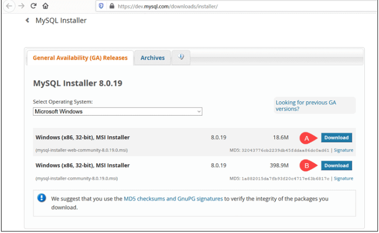
   After selecting a version, you are provided with the option of signing up for a MySQL Community account. If you are not interested, select the No thanks, just start my download option at the bottom of the page.
    ![alt text]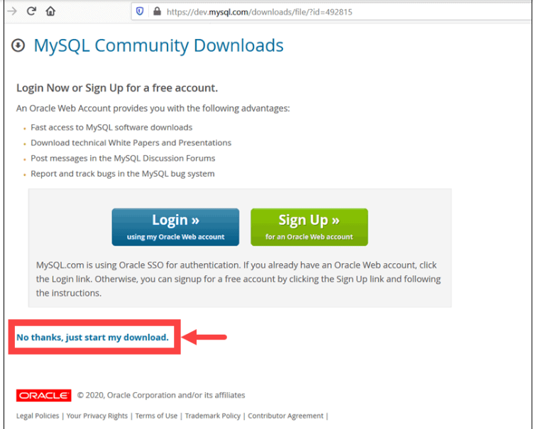
    By selecting this option, the download process starts immediately. Once the download is complete, you can execute the MySQL Installer file from the download folder.

It can take a few moments while Windows configures the MySQL Installer and prepares the installation and configuration process.

Set Up MySQL Installer for Windows
After accepting the Oracle license agreement terms, the first screen you encounter allows you to define which MySQL products are going to be installed. You can choose between several predefined options or create your custom setup type
After accepting the Oracle license agreement terms, the first screen you encounter allows you to define which MySQL products are going to be installed. You can choose between several predefined options or create your custom setup type.

Developer Default installs all the tools you need to develop and micromanage your MySQL databases effectively.
Server Only is used to install an instance of the MySQL Server and forgo other MySQL products.
Client Only installs all products except the MySQL Server and associated tools.
The Full configuration installs all available MySQL products.
A Custom setup allows you to select the individual elements that are to be installed and alter predefined default settings.

In the example below, we select the Server Only option and click Next.
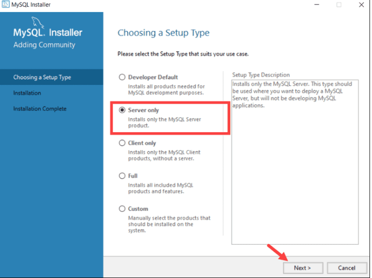
Click Execute to begin the installation process.
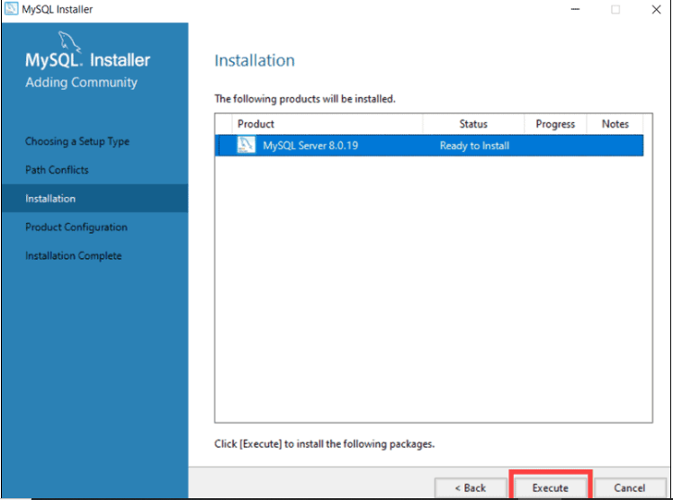
Once the status of the installation status is labeled as Complete, you are ready to configure the MySQL database.
Configure MySQL Server on Windows
The MySQL Server 8.0.19 is now ready to be configured. Initiate the process by clicking Next.
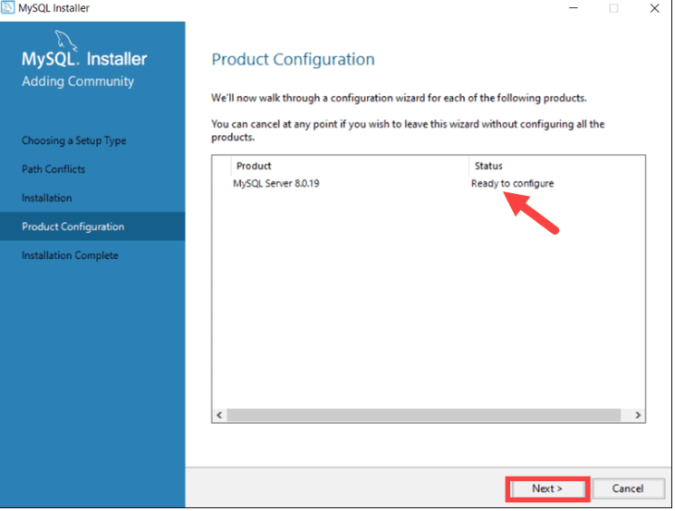
1. High Availability
The first configuration option affects database availability. It allows you to decide if you want to set up a Standalone MySQL Server or an InnoDB server cluster to improve availability. In this instance, we selected the classic, single server option.
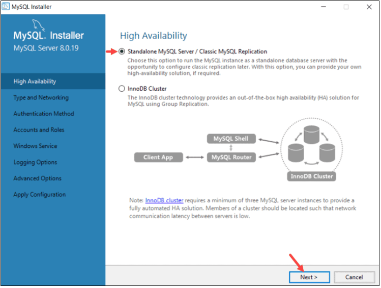
2. Type and Networking
The Type and Networking section is used to define several essential features.

The Config Type option lets you choose between three server configuration types. Development Computer, Server Computer, and Dedicated Computer define whether the server is dedicated solely to running your MySQL database or is going to share the underlying system with other applications.

In this example, we decided to create a development MySQL server.
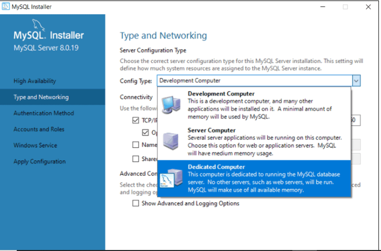
The Type and Networking tab can also define the port the MySQL server is listening on. The default setting is port number 3306 and can be changed to suit your needs.

By checking the Show Advanced and Logging Option box, you can set additional logging options at a later stage.

Click Next once you’ve selected the options you feel meet your requirements.
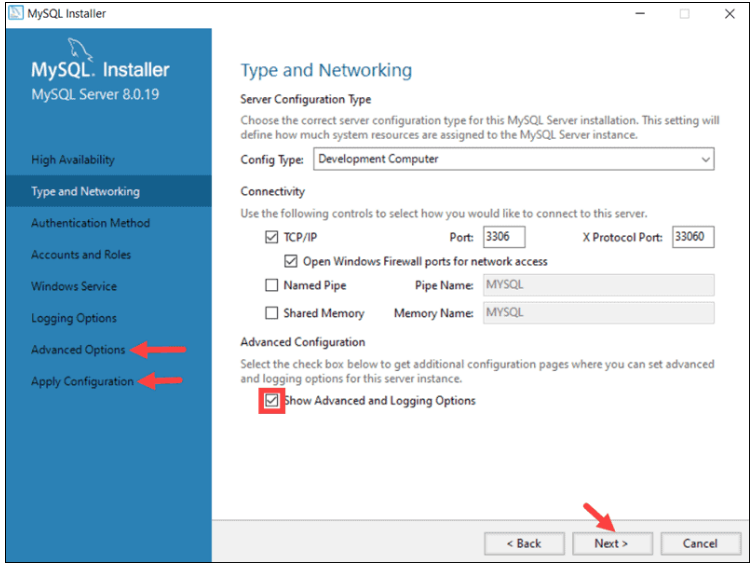
3. Authentication Method
It is possible to choose between two authentication methods, the recommended Strong Password Encryption, and the Legacy Authentication Method. Select the recommended Use Strong Password Authentication option.
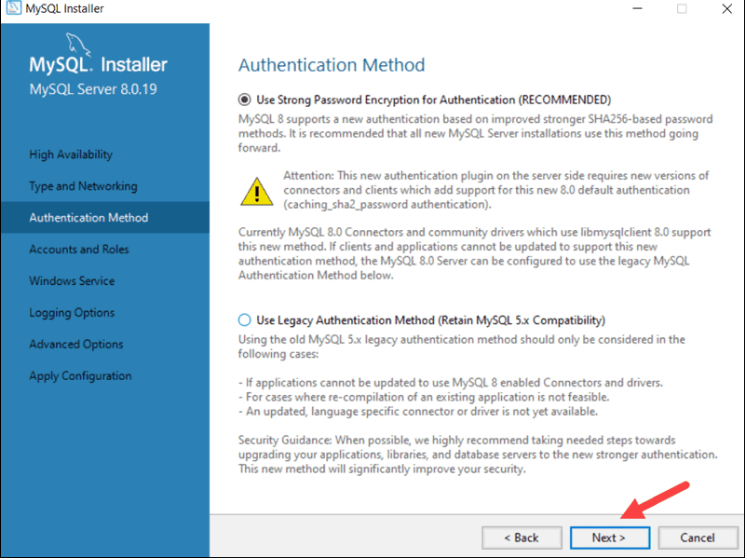
4. Accounts and Roles
You are now prompted to enter a password for your MySQL root user. You can also create additional roles for various users and purposes.

This is only an initial setup, and credentials can be edited once the installation is complete.
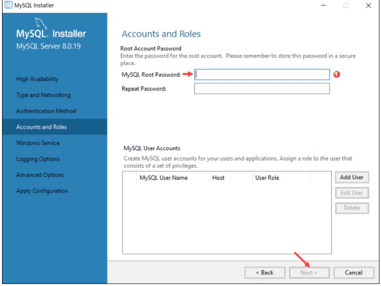
5. Windows Service
By defining MySQL as a Windows Service, it can now start automatically whenever the Windows system boots.

If you decide to start MySQL as an executable application, you would need to configure it manually.
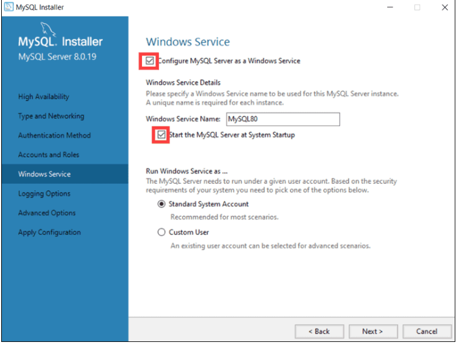
6. Logging Options (Optional)
If you have selected the Show Advanced Logging option in the Type and Networking tab, you are now able to set up MySQL log preferences.

Logging options let you select the types of logs you want to activate and define the log directories.
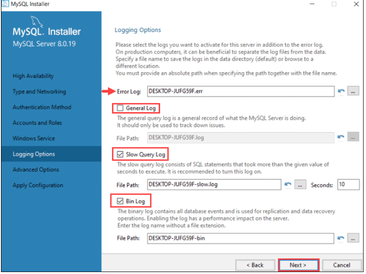
Click Next to reach the Advanced Options section.

7. Advanced Options (Optional)
Advanced Options include setting a unique server identifier, and the type of case (Lower/Upper) to be used for Table Names.

These settings are only available if you have checked the Show Advanced Options box in the Type and Networking tab.

8. Apply Configuration
You have successfully configured the MySQL server and need to confirm for the MySQL Installer to apply the configuration.

An overview of the configurations steps appears on the screen. Click Execute to apply the configuration.
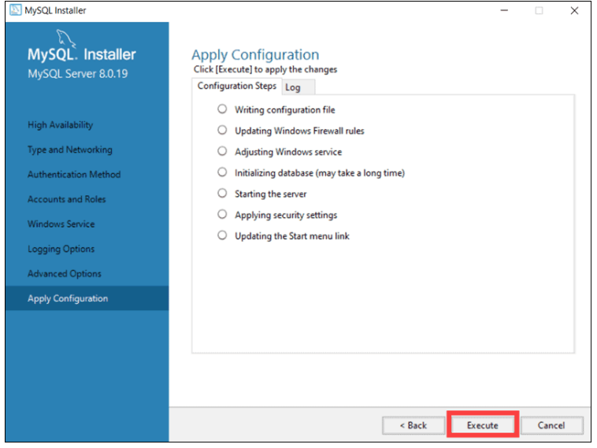
The system informs once the configuration process is completed. Select Next to continue the installation process.
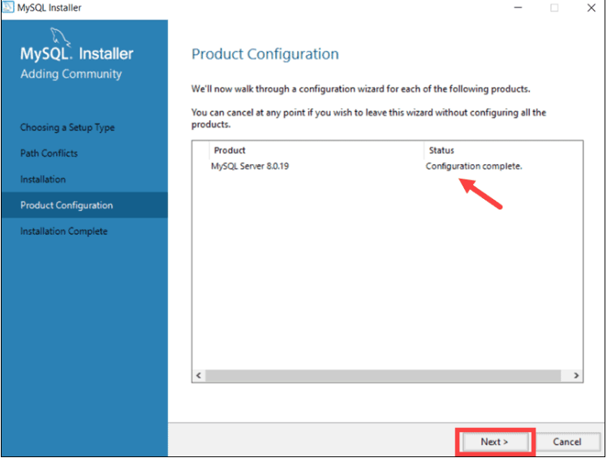
Complete MySQL Installation on Windows Server
After clicking Next, you are given the option to copy the installation process log to the Windows Clipboard.

Click Finish to complete the MySQL server installation on Windows.

Start MySQL Server on Windows
If you need to start the MySQL Server on Windows for the first time enter the following command in the Windows Command Prompt:

"C:\Program Files\MySQL\MySQL Server 8.0\bin\mysqld" --console

The path in this command is the default installation folder. In case you have installed MySQL in a different folder, the command needs to reflect that to launch the mysqld executable file successfully.

The --console option displays output directly on your console. Omitting this option sends the output directly to the MySQL logs.

Stop MySQL Server on Windows
To shut down MySQL Server in Windows, type the following command in the Windows Command Prompt:

"C:\Program Files\MySQL\MySQL Server 8.0\bin\mysqladmin" -u root shutdown

The mysqladmin tool performs the shutdown command and fully stops the MySQL server. The system does not provide output as confirmation.
7.  Set Up Development Environments and Virtualization (Optional):
   Consider using virtualization tools like Docker or virtual machines to isolate project dependencies and ensure consistent environments across different machines.
   Install Docker:
Download and install Docker Desktop for your operating system https://www.docker.com/get-started/.
Learn Docker Basics:
There are plenty of resources online to learn Docker commands and concepts. The official Docker documentation is a great place to start https://docs.docker.com/.
Create Dockerfiles:
Dockerfiles define how your container image is built, including installing dependencies and copying your application code. Learn how to write Dockerfiles from the official documentation.
Run Docker Containers:
Once you have a Dockerfile, you can use the docker build command to build an image and docker run to start a container from that image.
2. Using Virtual Machines (VMs):

VMs provide a more isolated environment with the ability to run a complete operating system within your current OS. They are better suited for situations requiring a specific OS or high security isolation.

Here's a basic setup guide:

Choose a Virtualization Software:
Popular options include VirtualBox https://www.virtualbox.org/, VMware Workstation Player https://www.vmware.com/products/workstation-player/workstation-player-evaluation.html.html.html.html, and Hyper-V (built-in on Windows 10 Pro/Enterprise).
Download and install your chosen software.
Create a Virtual Machine:
Each virtualization software has its own interface for creating VMs. You'll need to choose the desired operating system and allocate resources like RAM and storage.
Install Guest OS:
The VM will boot up and guide you through installing the chosen operating system.
Install Development Tools:
Once the OS is installed, you can install the necessary development tools and configure the environment for your project.
Additional Considerations:

Version Control System: Use a version control system like Git alongside your environment setup to keep track of your code changes.
IDEs: Many Integrated Development Environments (IDEs) have built-in support for Docker and virtual machines, streamlining your workflowInstall Docker:
Download and install Docker Desktop for your operating system https://www.docker.com/get-started/.
Learn Docker Basics:
There are plenty of resources online to learn Docker commands and concepts. The official Docker documentation is a great place to start https://docs.docker.com/.
Create Dockerfiles:
Dockerfiles define how your container image is built, including installing dependencies and copying your application code. Learn how to write Dockerfiles from the official documentation.
Run Docker Containers:
Once you have a Dockerfile, you can use the docker build command to build an image and docker run to start a container from that image.
2. Using Virtual Machines (VMs):

VMs provide a more isolated environment with the ability to run a complete operating system within your current OS. They are better suited for situations requiring a specific OS or high security isolation.

 a basic setup guide:

Choose a Virtualization Software:
Popular options include VirtualBox https://www.virtualbox.org/, VMware Workstation Player https://www.vmware.com/products/workstation-player/workstation-player-evaluation.html.html.html.html, and Hyper-V (built-in on Windows 10 Pro/Enterprise).
Download and install your chosen software.
Create a Virtual Machine:
Each virtualization software has its own interface for creating VMs. You'll need to choose the desired operating system and allocate resources like RAM and storage.
Install Guest OS:
The VM will boot up and guide you through installing the chosen operating system.
Install Development Tools:
Once the OS is installed, you can install the necessary development tools and configure the environment for your project.
Additional Considerations:

Version Control System: Use a version control system like Git alongside your environment setup to keep track of your code changes.
IDEs: Many Integrated Development Environments (IDEs) have built-in support for Docker and virtual machines, streamlining your workflow

8.  Explore Extensions and Plugins:
   Explore available extensions, plugins, and add-ons for your chosen text editor or IDE to enhance functionality, such as syntax highlighting, linting, code formatting, and version control integration.
   I choose visual studio code and this are some of the extensions
    syntax highlighting:There are two components to syntax highlighting: Tokenization: Breaking text into a list of tokens. Theming: Using themes or user settings to map the tokens to specific colors and styles.
     linting:Linting is the automated checking of your source code for programmatic and stylistic errors. This is done by using a lint tool (otherwise known as linter).
     code formatting:Code formatters are tools or programs that automatically format your source code according to predefined style guidelines and conventions. They help developers ensure consistent and clean code by automatically applying consistent indentation, spacing, line breaks, and other formatting rules.
     version control integration:Version control software facilitates coordination, sharing, and collaboration across the entire software development team. It enables teams to work in distributed and asynchronous environments, manage changes and versions of code and artifacts, and resolve merge conflicts and related anomalies.

9.  Document Your Setup:
    Create a comprehensive document outlining the steps you've taken to set up your developer environment. Include any configurations, customizations, or troubleshooting steps encountered during the process.
  Documentation of developers environment setup
1. I selected an operating system Windows 11.
 which was installed on my laptop.The process was quiet 
easy because i used the update windows option.
2.I installed an IDE(Integrated Development Environment)i choose visual studio code which i downloaded from vscode website.after the installation i also install some extensions
from the vscode extension tab e.g pylance, code runner ,python.
3.I also setup a Version control system which was git bash that was downloaded from github website,after installation i checked the git version with the  code git --version to if it was properlly installed.
There after i installed python programming language which was downloaded from there website.
4.I installed package manager PIP
5.I configured a database (MySQL)which was installed after following instructions from a website.   
    

#Deliverables:
- Document detailing the setup process with step-by-step instructions and screenshots where necessary.
- A GitHub repository containing a sample project initialized with Git and any necessary configuration files (e.g., .gitignore).
- A reflection on the challenges faced during setup and strategies employed to overcome them.

#Submission:
Submit your document and GitHub repository link through the designated platform or email to the instructor by the specified deadline.

#Evaluation Criteria:**
- Completeness and accuracy of setup documentation.
- Effectiveness of version control implementation.
- Appropriateness of tools selected for the project requirements.
- Clarity of reflection on challenges and solutions encountered.
- Adherence to submission guidelines and deadlines.

Note: Feel free to reach out for clarification or assistance with any aspect of the assignment.
